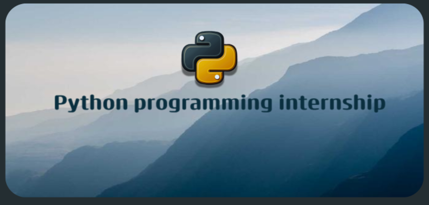

<!-- @format -->

<h1 align="center">CodeAlhpa Internship</h1>
&emsp;&emsp;&emsp;&emsp;&emsp;&emsp;&emsp;&emsp;&emsp;&emsp;&emsp;&emsp;&emsp;&emsp;&emsp;&emsp;



---

## About

This repository contains the tasks completed during my **Python Programming internship at CodeAlpha**, which I found through a **LinkedIn** online internship posting. The internship provided hands-on projects to strengthen Python fundamentals — from basic scripting to automation.

---

## Tasks

### Task 1 — Hangman Game
A classic word-guessing game where the player guesses letters to reveal a hidden word before running out of attempts.
- Random word selection from a predefined list
- Case-insensitive input with single-letter validation
- Repeated guess detection
- Win/loss tracking with 6 attempts

### Task 2 — Stock Portfolio Tracker
A CLI tool that calculates total investment value based on user input and hardcoded stock prices.
- Hardcoded price dictionary (AAPL, TSLA, MSFT, GOOGL, AMZN)
- Interactive input loop for multiple stocks
- Displays per-stock value and total
- Optional export to `.csv` or `.txt`

### Task 3 — JPG File Mover
Automates the repetitive task of gathering all `.jpg` files from a folder into a dedicated archive folder.
- Scans a source folder for `.jpg` files
- Moves them into a destination folder (created automatically)
- Leaves non-jpg files untouched
- Handles case-insensitive extensions

---

## How to Run

Each task has its own folder (`TASK 1/`, `TASK 2/`, `TASK 3/`) with a `python3` script. Navigate into the folder and run:

```bash
python3 myapp.py        # Task 1
python3 tracker.py      # Task 2
python3 move_jpgs.py    # Task 3
```
